# ProctAI-MERN

ProctAI-MERN is an AI-powered Automated Exam Proctoring System (AEPS) designed to ensure integrity and security in online examinations. Built using the MERN stack along with TensorFlow.js, the system provides real-time AI monitoring, automated grading, and performance analytics.

---

## 🏗 System Architecture

  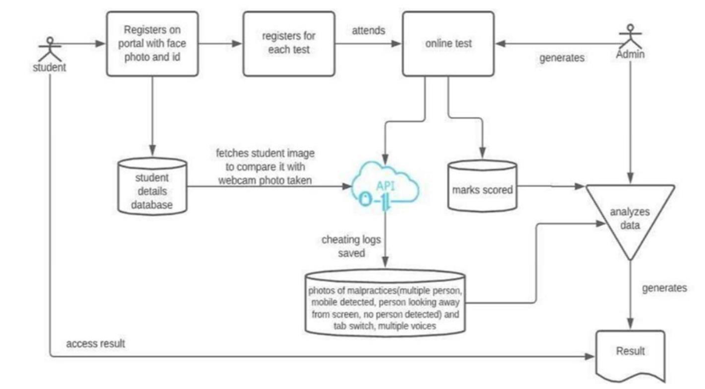

---

## 📚 Table of Contents

- [Tech Stack](#-tech-stack)
- [Current Functionality](#-current-functionality)
- [Future Scope](#-future-scope)
- [Project Screenshots](#-project-screenshots)
- [Deployed Website](#-deployed-website)
- [Test Users](#-test-users)

---

# 🛠 Tech Stack

## Backend
- Node.js
- Express.js
- MongoDB
- Mongoose
- JSON Web Tokens (JWT)
- Express-Async-Handler
- Cloudinary (for cheating screenshot storage)

## Frontend
- React.js
- Redux Toolkit
- TensorFlow.js
- Material UI
- React Router
- React Toastify
- React Webcam

---

# 🚀 Current Functionality

## 🔐 User Authentication & Role Management
- Role-based login for Students and Teachers
- Secure JWT-based authentication
- Password hashing using bcrypt

## 👨‍🏫 Teacher Capabilities
- Create and manage exams
- Add and configure questions
- View cheating logs
- Access student performance analytics

## 👨‍🎓 Student Functionality
- View and attempt available exams
- Real-time timer with auto-submit
- View results and analytics after submission

## 🤖 AI Exam Proctoring
- Mobile phone detection
- Multiple face detection
- Face not visible detection
- Tab switch detection
- Automatic logging of suspicious activity

## 📊 Result & Performance Analysis
- Automatic objective grading
- AI-based subjective grading (NLP powered)
- Instant result generation
- Student analytics dashboard
- Email notification after submission

---

# 🔮 Future Scope

## Candidate Verification
- Real-time face verification with registered student

## Voice Recognition
- Voice anomaly detection during exams

## Unified Portal
- Integrated exam + chat + document upload system

---

# 📸 Project Screenshots

## 🔐 Login Page

  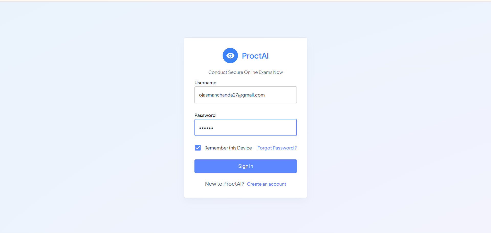

## 📊 Dashboard

### Student Dashboard

  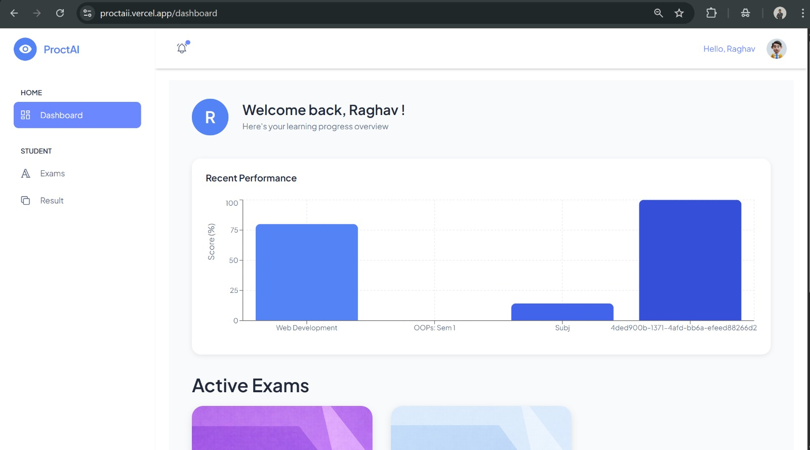

### Teacher Dashboard

  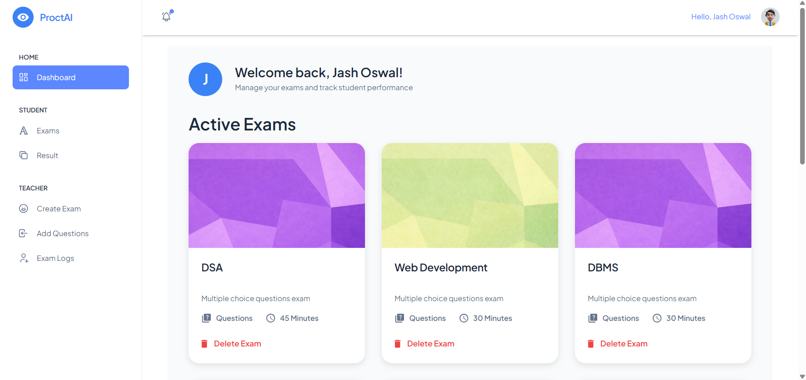

---

## 📝 Exam Creation

### Create Exam

  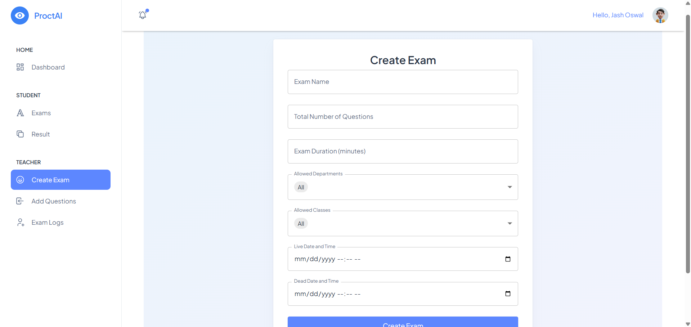

### Create Questions

  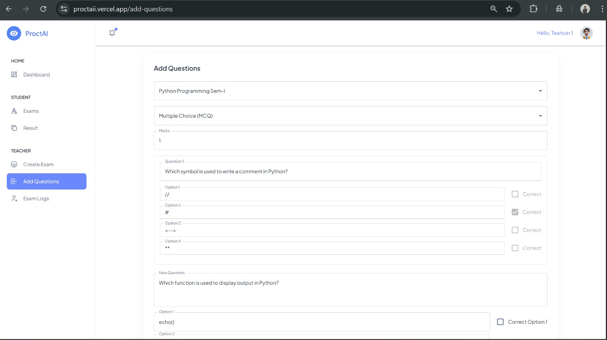

### All Student Results

  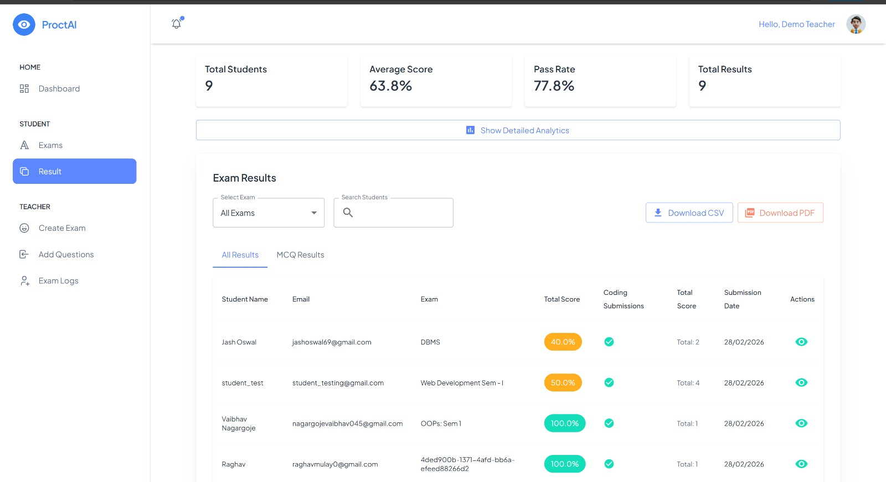

### Student Marks Analysis

  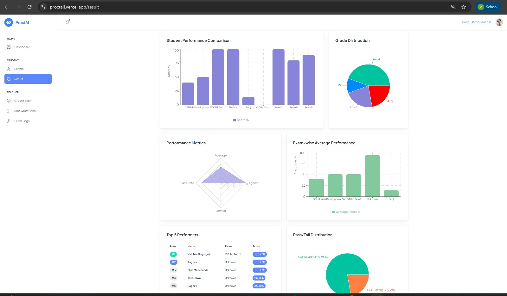

---

## 🚨 Cheating Detection During Exam

### Cell Phone Detection

  

### Face Not Visible Detection

  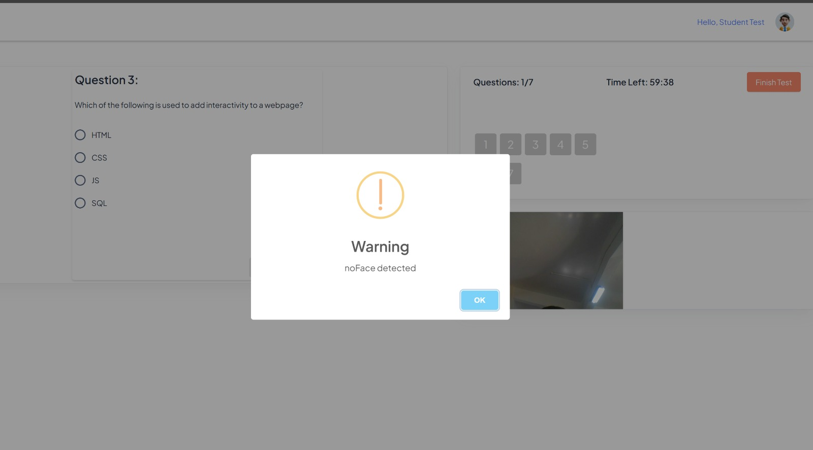

### Multiple Face Detection

  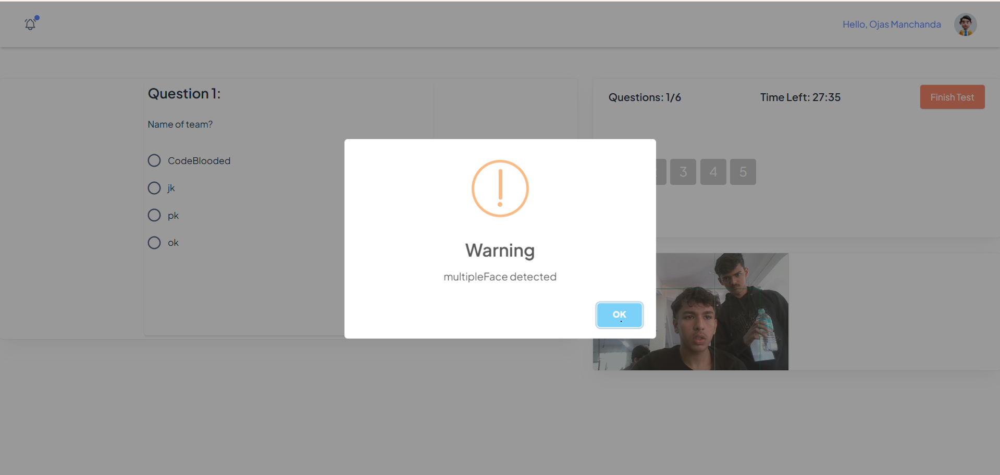

### Tab Switch Detection

  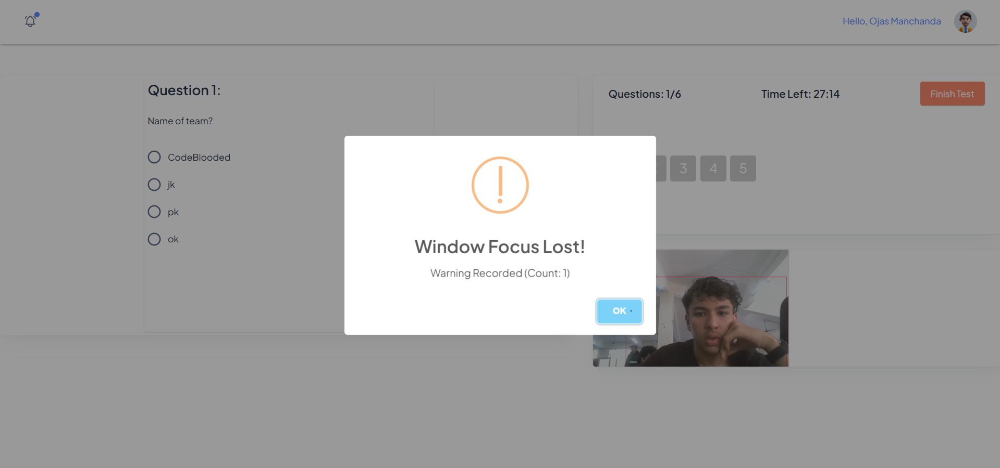

---

## 🧠 AI Grading (NLP)

  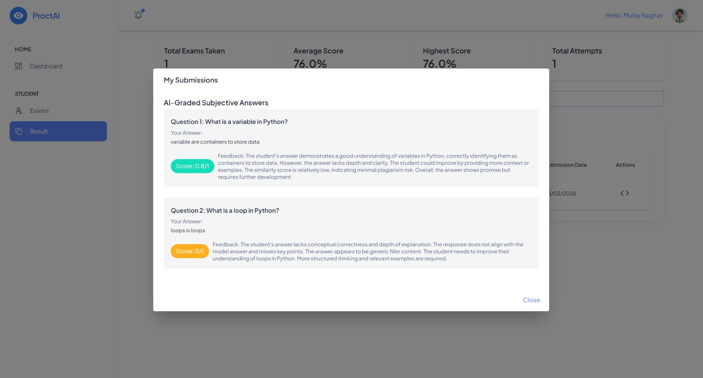

---

## 📧 Email Notification After Submission

  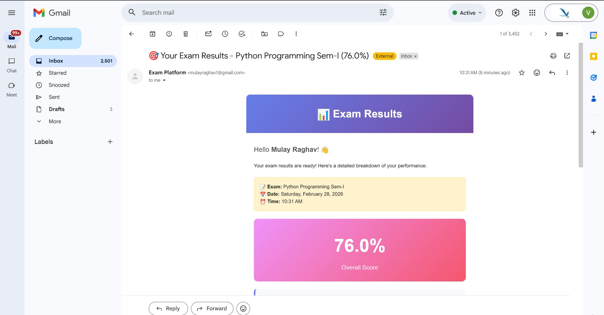

---

## 📈 Student Performance Analytics

  
  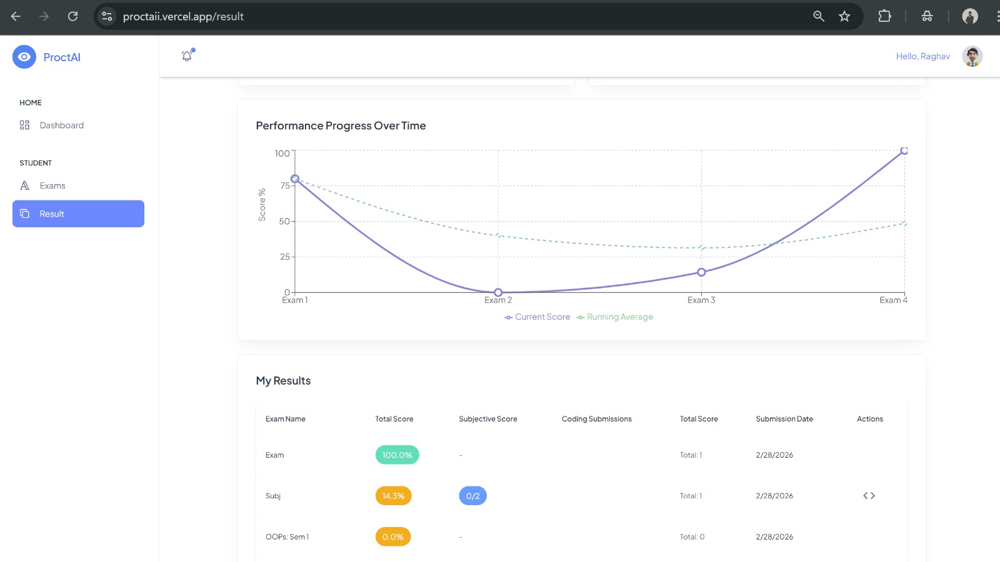

---

# 🌍 Deployed Website

https://proctaii.vercel.app/

---

# 🔐 Test Users

### 👨‍🎓 Student Account
Email: student_testing@gmail.com  
Password: 123456  

### 👨‍🏫 Teacher Account
Email: teacher@test.com  
Password: 123456  

---

